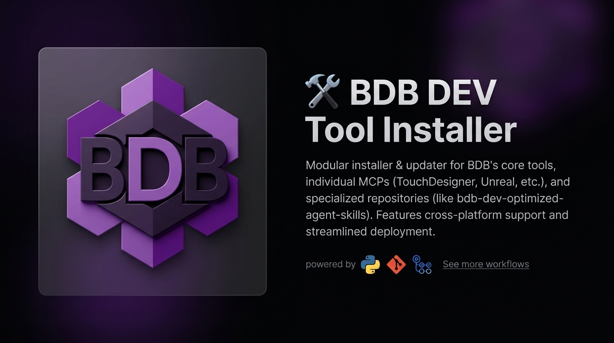

<div align="center">
  

  # 🛠️ BDB DEV Tool Installer
</div>

A modular, cross-platform **General Installer & Updater** designed to centrally deploy, manage, and update all **BDB DEV Tools**. 

This includes:
- **Core Tools:** BDB Token-Saver, memB, and BDB OpenWiki.
- **BDB MCPs:** Individual MCP servers like TouchDesigner, Grandma3, Resolume, Unreal Engine, Rhino, and more.
- **Hybridlabor Repositories:** Full project cloning and updating for repositories like `bdb-dev-optimized-agent-skills`, `ebay-kleinanzeigen-api`, and others.

Running the installer again over an existing installation will automatically update the tools or perform a `git pull` on cloned repositories to ensure you have the latest available versions.

---

## 📦 Available Tools Overview & Technical Specs

### 1. ⚡ BDB Token-Saver (Context Window CLI Output Optimizer)

**Token-Saver** is a drop-in context window optimizer for AI coding assistants (Google Antigravity CLI, Claude Code). It intercepts verbose CLI command outputs—such as `git diff`, `pytest`, `npm install`, `docker`, `kubectl`, and `terraform plan`—compressing them by **60–99%** before they reach the LLM context window.

#### Key Features & Technical Specifications:
- **36 Specialized Processors:** Tailored output compactors for `git`, `test` (pytest, jest, vitest, cargo, go), `docker`, `kubectl`, `terraform`, `package_list` (pip, npm, brew), `build_output`, and more.
- **Zero Information Loss:** All error messages, failure stack traces, warnings, and actionable diffs are 100% preserved.
- **Pure Deterministic Compression:** Zero added latency. No LLM calls required. Operates offline using high-performance regex parsing.
- **Platform Hooks:**
  - **Google Antigravity CLI:** Operates via `AfterTool` output replacement hook.
  - **Claude Code:** Operates via `PreToolUse` wrapper interception hook.
- **CLI Commands:**
  ```bash
  heimdall version              # Print version (v2.6.3)
  heimdall stats                # Display cumulative token & bill savings
  heimdall stats --json         # Export JSON statistics for reporting
  heimdall benchmark 'git diff' # Measure compression ratio on any CLI command
  heimdall update               # Check and apply updates automatically
  ```

---

### 2. 🧠 memB (Local-First Hybrid Long-Term Memory Engine)

**memB** provides AI agents with persistent, searchable long-term memory across sessions and projects. It operates as a local Model Context Protocol (MCP) server backed by ChromaDB vector storage.

#### Key Features & Technical Specifications:
- **Persistent Recall:** Stores user preferences, code architecture choices, and project conventions locally.
- **Hybrid Retrieval:** Combines semantic vector similarity search with structured metadata filtering.
- **Privacy & Security:** Runs 100% locally on your workstation. No external memory cloud dependencies.
- **Automated Bootstrapping:** Self-contained Python virtual environment (`.venv`) managed by the installer.

---

### 3. 📚 BDB OpenWiki (Autonomous Documentation Manager)

**BDB OpenWiki** automatically generates, updates, and synchronizes project documentation, architecture diagrams, and release notes based on git activity and codebase changes.

#### Key Features & Technical Specifications:
- **Gemini 2.5/3.0 Powered:** Connects via `GEMINI_API_KEY` for intelligent change summarization.
- **Background Daemon:** Runs as an OS daemon (`systemd` on Linux, `launchd` on macOS, Scheduled Task on Windows) for continuous documentation updates.
- **One-Shot & Live Modes:** Can be triggered manually or run as an automated background process.

---

### 4. 🔌 BDB Model Context Protocol (MCP) Ecosystem

**MCP Servers** allow AI agents (Google Antigravity, Claude Code) to interact with local hardware, 3D engines (Unreal, Rhino, Blender), visual synthesis software (TouchDesigner, Resolume), lighting consoles (grandMA3), and local memory stores.

#### Quick Highlights:
- **20+ Pre-Configured MCPs:** Specialized adapters for TouchDesigner, Unreal Engine, grandMA3, Resolume, DaVinci Resolve, Rhino, Blender, and OS automation.
- **Automated Registration:** The installer configures `~/.gemini/antigravity-cli/mcp_config.json` automatically upon installation.
- **Deep Architecture Guide:** For full technical details, transport specifications, and the complete catalog of servers, see the [MCP Architecture & Server Directory](mcp_readme.md).

---

## 🚀 Quick Start & Installation

### Option 1: macOS & Linux
```bash
git clone https://github.com/hybridlabor-api/bdb-dev-tool-installer.git
cd bdb-dev-tool-installer
sh install.sh
```

For unattended / automated setup:
```bash
node installer.js -y
```

---

### Option 2: Windows PowerShell
Run PowerShell as Administrator or with script execution permitted:
```powershell
git clone https://github.com/hybridlabor-api/bdb-dev-tool-installer.git
cd bdb-dev-tool-installer
powershell -ExecutionPolicy Bypass -File install.ps1
```

---

### Option 3: Via NPX (Global Installer)
```bash
npx @hybridlabor-api/bdb-dev-tool-installer
```

---

## 🧩 Adding Future BDB-DEV Tools (Step-by-Step)

The installer is built around a modular architecture (`registry.json`). To add a new BDB-DEV tool in future updates:

1. Add the tool payload folder under `tools/<new-tool-name>/`.
2. Register the tool in `registry.json`:
   ```json
   {
     "id": "new-tool-name",
     "name": "BDB New Tool",
     "description": "Short description of the tool",
     "type": "mcp",
     "path": "tools/new-tool-name",
     "default": true
   }
   ```
3. Add a dedicated setup handler function inside `installer.js` if custom build steps (e.g., `npm install` or `pip install`) are required.

---

## 📄 Licensing

- **Installer Framework:** ISC License
- **BDB Token-Saver Component:** Apache License 2.0
- **memB & OpenWiki Components:** Proprietary / BDB DEV License
