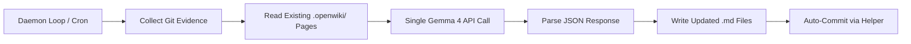

# OpenWiki Skill: Gemini-Native Codebase Documentation Engine

This skill equips the Antigravity agent with a direct, Gemini-native implementation of OpenWiki. It automatically scans repositories for changes, creates and maintains a high-quality codebase wiki inside the `.openwiki/` directory, updates root-level instructions (`agent.md`/`CLAUDE.md`), updates project `README.md` files, and automatically commits documentation changes with structured git messages.

---

## Architecture

The OpenWiki daemon uses the **Gemma 4 API** (`gemma-4-12b-it`) directly via the `google-genai` Python SDK. It does **not** spawn `agy` conversations or any external agent processes.



This eliminates the previous issues of zombie sidebar conversations, GitHub MCP quota drain, and OAuth auth timeouts.

---

## When to Invoke This Skill

- **On-Demand**: When the user explicitly requests to update the wiki, document a feature, update the README, or write release notes. Run the workflow steps below inside the active conversation.
- **Automated (Daemon)**: The background daemon runs every 2 hours via `StartInterval` (macOS) or Task Scheduler (Windows), calling the Gemma 4 API directly.

---

## Setting Up `GEMINI_API_KEY`

The daemon requires a Gemini API key to call the Gemma 4 model. Gemma 4 12B is available on the free tier.

1. Get a key from [Google AI Studio](https://aistudio.google.com/apikey)
2. Set it in your environment:
   ```bash
   # macOS / Linux
   export GEMINI_API_KEY=your-key-here

   # Windows PowerShell
   $env:GEMINI_API_KEY = "your-key-here"
   ```
3. The install scripts will embed the key into the LaunchAgent plist / Scheduled Task.

If no key is set, the daemon runs in **collect-only mode**: it gathers git evidence but skips documentation generation (no crash, no error).

---

## Core Documentation Artifacts

The agent is responsible for maintaining the following files at the root of the project:

### 1. The Wiki Directory (`.openwiki/`)
A modular folder containing markdown pages designed for both human readers and AI subagents:
- **`.openwiki/quickstart.md`**: The navigation hub. Contains developer onboarding steps, quick CLI commands, test suites instructions, and workspace orientation.
- **`.openwiki/architecture.md`**: Tech stack, module boundaries, data flows, third-party integrations, and directory structure maps.
- **`.openwiki/release_notes.md`**: Organized release timeline, version numbers, features shipped, and changelogs.
- **`.openwiki/decisions.md`**: Log of key design decisions, API trade-offs, and architecture constraints.

### 2. Root Entrypoints
- **`agent.md` or `CLAUDE.md`**: Must be kept up to date and contain a reference block directing subsequent agents to read `.openwiki/quickstart.md` for context.
- **`README.md`**: Updated to show current status, active API contracts, features list, and links to the detailed wiki pages.

---

## 🔒 Safety and Privacy Rules (PII Protection)
1. **Never Leak Local Username / Paths:** Under no circumstances should absolute paths containing local usernames (e.g. `/Users/username/...`) be written to repository files, documentation, README, or wiki markdown files. Always use relative paths (`skills/global_config/...` or `.openwiki/quickstart.md`) or generic home folder variables (e.g. `~/.openwiki/` or `$HOME/...` or `<your-user-home>`).
2. **Never Leak Secrets:** Do not commit or document API keys, OAuth tokens, passwords, private configuration details, or credentials in any file. Use placeholders like `<API_KEY>` or point the user to configure `.env` files.
3. **No External URL Leaks:** Avoid hardcoding personal repository structures or domains unless they are public.

---

## Step-by-Step Execution Workflow (On-Demand)

Follow this procedure when executing the OpenWiki cycle manually inside a conversation:

### Step 1: Collect Git Evidence & Identify Changes
Execute the Python helper script to collect git status, diff logs, and check for a clean workspace:
```bash
python3 ~/.gemini/config/skills/openwiki-skill/scripts/openwiki_helper.py --command collect
```
Review the printout carefully to identify:
- Which files were recently added, modified, or deleted.
- The commits added since the last documentation sync (if any).
- Current unstaged changes.

### Step 2: Compute Pre-Run Hash
Determine if there are active changes in the wiki directory:
```bash
python3 ~/.gemini/config/skills/openwiki-skill/scripts/openwiki_helper.py --command pre-snapshot
```
Save the returned hash in your context. If the Git log, status, and pre-run hash indicate no functional modifications occurred in the codebase since the last update, you may skip execution early to conserve tokens.

### Step 3: Map Documentation Plan
Define which pages need updates:
- If a new feature was added → Update `.openwiki/architecture.md`, `README.md`, and write new release notes in `.openwiki/release_notes.md`.
- If setup steps changed → Update `.openwiki/quickstart.md`.
- Bump project versions and update the changelog in `package.json` if applicable.

### Step 4: Perform Documentation Updates
Write and edit markdown files under `.openwiki/`.
- **Aesthetic standard**: Follow professional technical writing guidelines. Use clear headings, markdown tables for configurations, code block syntax highlighting, and github-style alert blocks (`> [!NOTE]`).
- **Grounding constraint**: Document ONLY what is actually implemented in code. Do not speculate or invent features.

### Step 5: Update Root Redirects
Verify that `agent.md` or `CLAUDE.md` contains the mandatory OpenWiki block:
```markdown
## Documentation & Wiki
- Entrypoint: [.openwiki/quickstart.md](.openwiki/quickstart.md)
- Reference guides: [architecture.md](.openwiki/architecture.md), [release_notes.md](.openwiki/release_notes.md)
```

Update the main `README.md` to link to `.openwiki/quickstart.md` for full developer docs.

### Step 6: Post-Snapshot Sync
Run the post-snapshot script to compare changes and write metadata update details:
```bash
python3 ~/.gemini/config/skills/openwiki-skill/scripts/openwiki_helper.py --command post-snapshot --pre-hash <pre-hash-from-step-2>
```

### Step 7: Auto-Commit Documentation
To keep the git history clean and separate documentation churn from code changes, stage and commit the updated wiki files using the helper script:
```bash
python3 ~/.gemini/config/skills/openwiki-skill/scripts/openwiki_helper.py --command commit
```
This stages `.openwiki/`, `README.md`, `agent.md`, and `CLAUDE.md`, and commits them under the prefix: `docs(wiki): update project specs and codebase documentation [auto]`.

---

## Daemon Mode (Background)

The daemon script (`openwiki_daemon.py`) runs as a background service:

- **macOS**: Installed as a LaunchAgent via `install_daemon.sh`. Uses `StartInterval` (7200s = 2 hours) with `--one-shot` flag per invocation. No long-running process.
- **Windows**: Installed as a Scheduled Task via `install_daemon.ps1`. Repeats every 2 hours with `--one-shot`.

Each invocation:
1. Reads `~/.openwiki/projects.json` for registered project paths
2. Runs `openwiki_helper.py --command collect` to gather git evidence
3. Checks for meaningful changes (new commits or unstaged diffs)
4. If changes found, calls Gemma 4 API with evidence + existing wiki pages
5. Parses JSON response and writes updated `.openwiki/*.md` files
6. Runs `openwiki_helper.py --command commit` to auto-commit

Install:
```bash
# macOS
bash ~/.gemini/config/skills/openwiki-skill/scripts/install_daemon.sh

# Windows (PowerShell as Admin)
powershell -ExecutionPolicy Bypass -File install_daemon.ps1
```
