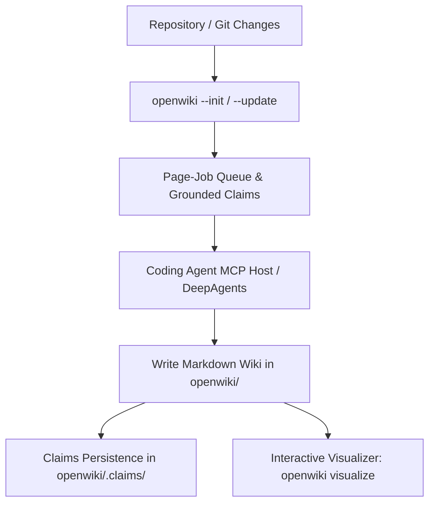

# OpenWiki Skill: Codebase & Personal Knowledge Wiki Engine

This skill integrates the official **OpenWiki** ([`langchain-ai/openwiki`](https://github.com/langchain-ai/openwiki)) into BDB Agent OS and Google Antigravity workflows. It provides autonomous documentation generation, Grounded Claims verification, an interactive local node graph visualizer, and host integrations for coding agents via Model Context Protocol (MCP).

---

## 1. Upstream Package & Remote Updates

OpenWiki is distributed globally via `npm`:
- **Repository**: [https://github.com/langchain-ai/openwiki](https://github.com/langchain-ai/openwiki)
- **Package**: `openwiki` (v0.5.0+)
- **Runtime**: Node.js >= 22

### Pulling Remote Updates
To check and pull the latest upstream version:
```bash
# Check installed vs latest version
npm view openwiki version

# Update to latest upstream release
npm install -g openwiki@latest

# Verify installation
openwiki integrations list
```

A companion helper script is available in `scripts/update_openwiki.sh`:
```bash
bash skills/global_config/openwiki-skill/scripts/update_openwiki.sh
```

---

## 2. Core Capabilities & Architecture



### Key Differences from Legacy Wrapper
- **Official OpenWiki Directory**: Writes to `openwiki/` (with `.claims/` and `.page-manifest.json`).
- **Grounded Claims**: Material facts in pages carry versioned repository evidence citations (e.g. `repo://src/server.ts#L40-L82`). Stale or changed code automatically flags propositions for revision.
- **Resumable Lifecycle**: Interrupted runs checkpoint into `openwiki/.run.json` and resume deterministically.
- **Interactive Visualizer**: Instant local graph server (`openwiki visualize`) or deployable static bundle (`openwiki visualize --export <dir>`).

---

## 3. CLI Commands

### Initialize or Update Documentation
```bash
# Initialize a new repository wiki in openwiki/
openwiki --init

# Update existing repository wiki based on changes and stale claims
openwiki --update

# Non-interactive one-shot update
openwiki -p --update "Document recent architecture updates"

# Initialize or update personal knowledge wiki (stores in ~/.openwiki/wiki)
openwiki personal --init
openwiki personal --update
```

### Explore Wiki via Visualizer
```bash
# Launch interactive node graph on 127.0.0.1:4321
openwiki visualize

# Launch on custom port without opening browser automatically
openwiki visualize openwiki --port 4321 --no-open

# Export static HTML/JS/CSS bundle for GitHub Pages or MkDocs
openwiki visualize openwiki --export docs/openwiki-visualizer
```

---

## 4. Coding Agent Integrations (MCP)

OpenWiki connects to coding agents (Claude Code, OpenCode, Codex, Cursor) via MCP so the agent uses its own model and tools while OpenWiki manages the durable lifecycle.

### Setup Host Integrations
```bash
openwiki integrations install claude
openwiki integrations install opencode
openwiki integrations install codex
openwiki integrations install cursor
```

### Verify Status
```bash
openwiki integrations list
```

### Lifecycle MCP Tools
The integration exposes the native generation lifecycle:
1. `openwiki_begin`: Initiates run, checks Git root and diff status.
2. `openwiki_submit_plan`: Submits page breakdown and taxonomy.
3. `openwiki_next_page`: Fetches the next pending page in the queue.
4. `openwiki_inspect_page_claims`: Optional inspection of claims requiring attention.
5. `openwiki_submit_page`: Submits page prose and sparse Claim updates.
6. `openwiki_finish`: Finalizes OKF manifest and provenance.

## 5. Page Quality & Claims Contract

Every factual Markdown page generated under `openwiki/` MUST begin with valid OKF frontmatter:
```yaml
---
type: <short descriptive concept type>
title: <human-readable title in the run language>
description: <one or two sentence retrieval-oriented summary in the run language>
tags: [<stable English tag>, ...]
---
```

Do not author generated, verified, sources, timestamp, or OpenWiki control fields. OpenWiki owns those. On update preserve accurate unknown producer-defined frontmatter fields.

### Claims Contract
A Claim is one substantive, independently falsifiable system truth. Prefer behavior, responsibilities, architecture/ownership, relationships, flow, invariants, lifecycle/failure semantics, configuration, security, persistence, operations, and extension seams.
- Each Claim must cite one or more repository resources, preferably bounded language-agnostic spans such as `repo://src/auth.ts#L20-L48`.
- Every resource MUST begin with `repo://` and use a repository-relative path; never submit a bare path such as `src/auth.ts`.
- The reconciled page must retain or establish at least one material repository-grounded Claim.
- Structured Claim state lives under `openwiki/.claims/`.

---

## 6. Root Entrypoints Standard

Every repository using OpenWiki must maintain references in root files:

### `agent.md` or `CLAUDE.md`
```markdown
## Documentation & Wiki
- Entrypoint: [openwiki/quickstart.md](openwiki/quickstart.md)
- Reference guides: [openwiki/architecture.md](openwiki/architecture.md)
```

### `README.md`
Include link to `openwiki/quickstart.md` or the exported visualizer directory.

---

## 7. 🔒 Safety and Privacy Rules (PII Protection)
1. **Never Leak Local Username / Paths**: Under no circumstances should absolute paths containing local usernames (e.g. `/Users/username/...`) be written to repository files, documentation, README, or wiki markdown files. Always use repository-relative paths (`openwiki/...`) or generic home folder variables (e.g. `~/.openwiki/`).
2. **Never Leak Secrets**: Do not commit or document API keys, OAuth tokens, passwords, private configuration details, or credentials in any file. Use placeholders like `<API_KEY>`.
3. **Never Modify Source Code**: OpenWiki only creates and updates documentation in `openwiki/` and root redirects.

---

## 8. Verification Checklist
- [ ] Verified `openwiki` binary is installed and executable (`openwiki integrations list`).
- [ ] Checked that `openwiki/` contains valid markdown pages with OKF frontmatter.
- [ ] Confirmed interactive visualizer builds or runs (`openwiki visualize openwiki --export <dir>`).
- [ ] Ensured root instructions (`agent.md`/`CLAUDE.md`) reference `openwiki/quickstart.md`.
- [ ] Confirmed no absolute paths or credentials leaked in `.md` files.
